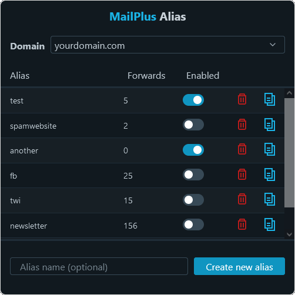

# MailPlus Alias Extension

:warning: This project is still in development. I built it for my own needs, so it might not suit yours. However, feel free to open an issue or contribute if you find a bug or want to improve this
extension.

[Download on addons.mozilla.org](https://addons.mozilla.org/fr/firefox/addon/mailplus-alias/)

## Features

This extension allows you to create email aliases for your [Synology MailPlus](https://www.synology.com/fr-fr/dsm/feature/mailplus) account directly from your browser. Idea is the same
as [Firefox Relay](https://relay.firefox.com/) but with your own server, own domain and with no limitation because you can create as much alias as you want for your MailPlus account.

### Context menu

You can create a random alias in any input field from the context menu. Just right click on a field and select "Generate new MailPlus alias", the field will then be filled with it.

### Forward/block

By default, all created aliases are enabled and will forward to your default MailPlus email address. You can block an alias by clicking the switch.

When blocked, the mail server will reject every email sent to the alias. Just click again to reactivate forwarding.

When deleted, an alias is automatically blocked. This is a safety mesure in case the mail server is configured to forward any inexistant address. If you create an alias with the same name later, it
will be unblocked.

You can see the number of forwarded emails for a given alias just next to it.

## Only for Synology MailPlus

This extension can only be used by default by administrators of a [Synology MailPlus Server](https://www.synology.com/fr-fr/dsm/feature/mailplus). DSM users that are not administrators need to have a
delegated permission to access aliases and security features.

To delegate the access, the administrator need to open the MailPlus Server application in DSM and do the following:

* Go to "Account" > "Delegation"
* Click on "+" to add a delegation
* Select the "Custom" delegation profile
* Check "Domain > Alias" and "Security > Mail Delivery Security" (to block/unblock aliases)
* Add the users or group you want to have those permissions in the second tab
* Click "OK"

:warning: This extension does not allow touching other user's data, however with the previous DSM permissions, the users will in theory be able to edit EVERY blacklist/whitelist rules, other "Mail
Delivery Security" features and EVERY alias for every user from the DSM interface or with API requests.

## Install

[Download on addons.mozilla.org](https://addons.mozilla.org/fr/firefox/addon/mailplus-alias/)

## Build

Run `./build.sh` (linux) inside the project directory. This build script only require the `zip` package to be installed on your system, otherwise you will have to zip the built folder yourself.